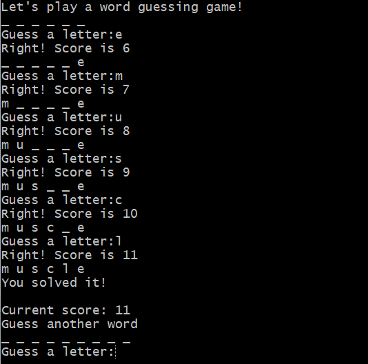

# Word Guess Game

## Overview:

### Instructions:
1. Download the anat19.txt file from the GitHub and save it in the same folder as your Python program. The file is the text from one chapter of an anatomy textbook. Send the filename to the main program in a system argument. If no system arg is present, print an error message and exit the program.
2. Read the input file as raw text. Calculate the lexical diversity of the tokenized text and output it, formatted to 2 decimal places. Lexical diversity is the number of unique tokens divided by the total number of tokens. Lexical diversity indicates the richness of vocabulary in a text. For example, a lexical diversity of 0.05 means that 5% of the words in a text are unique.
3. Write a function to preprocess the raw text:

    1. tokenize the lower-case raw text, reduce the tokens to only those that are alpha, not in the NLTK stopword list, and have length > 5  
    2. lemmatize the tokens and use set() to make a list of unique lemmas  
    3. do pos tagging on the unique lemmas and print the first 20 tagged  
    4. create a list of only those lemmas that are nouns  
    5. print the number of tokens (from step a) and the number of nouns (step d)  
    6. return tokens (not unique tokens) from step a, and nouns from the function  
	
<style type="text/css">
    ol { list-style-type: upper-alpha; }

4. Make a dictionary of {noun:count of noun in tokens} items from the nouns and tokens lists; sort the dict by count and print the 50 most common words and their counts. Save these words to a list because they will be used in the guessing game.
5. Make a guessing game function:

      A. give the user 5 points to start with; the game ends when their total score is negative, or they guess ‘!’ as a letter  
      B. randomly choose one of the 50 words in the top 50 list (See the random numbers notebook in the Xtras folder of the GitHub)  
      * c. output to console an “underscore space” for each letter in the word  
      * d. ask the user for a letter  
      * e. if the letter is in the word, print ‘Right!’, fill in all matching letter _ with the letter and add 1 point to their score  
      * f. if the letter is not in the word, subtract 1 from their score, print ‘Sorry, guess again’  
      * g. guessing for a word ends if the user guesses the word or has a negative score  
      * h. keep a cumulative total score and end the game if it is negative (or the user entered ‘!’) for a guess  

</style>

Open your favorite Terminal and run this command.

First Tab:

```sh
python guessgame.py anat19.txt
```

Sample run of the game:

