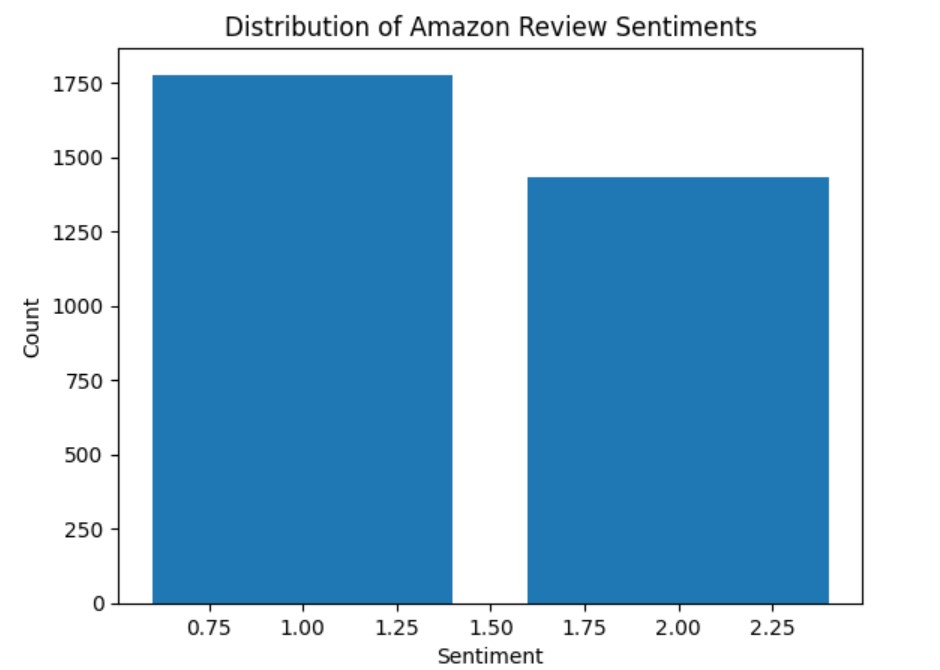
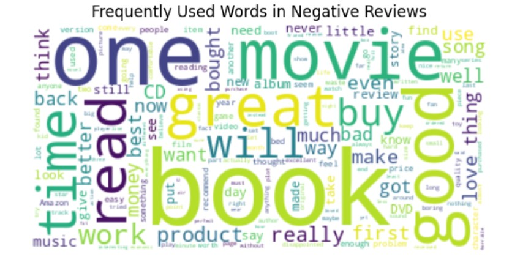

**AI/Natural Language Processing**

**Title: NLP Machine Learning Algorithms**

The results for the accuracy score in the text classification using machine learning with Python exercise are as follows:

1. Naïve Bayes Algorithm - 0.7414330218068536 
2. Logistic Regression - 0.8769470404984424 
3. Random Forest - 0.7429906542056075 
4. SVM Linear Algorithm - 0.8629283489096573
5. SVM  Radial Algorithm - 0.5327102803738317

The results of the text classification task revealed that the Linear and Logistic Regression algorithms performed better than the other algorithms, while the SVM Radial algorithm had the worst performance. Logistic regression is a type of algorithm that is specifically designed and optimized for classification tasks, and it is known to produce better results compared to other algorithms. Hence, it performed the best in this task. Linear Algorithm is quite similar to Logistic Regression, but it is optimized for quantitative analysis. As a result, it performed almost as well as the Logistic Regression algorithm. 

In contrast, the SVM Radial algorithm performed poorly due to its regularization parameter. The regularization parameter determines how much the algorithm should avoid misclassifying each training example, and in this case, it caused the optimizer to search for a larger-margin separating hyperplane. This led to the misclassification of more reviews, resulting in poor performance. Naive Bayes algorithm performed reasonably well due to its "assumption of independence" nature, where all items are considered independent of each other. Random Forest algorithm produced a good score but not better than the Logistic Regression algorithm. This is because it requires a large number of “trees in the forest” for training to improve performance.

**Summary of all the algorithms**

The performance of different algorithms for text classification varies depending on the specific dataset and the problem being solved. In general, each algorithm has its strengths and weaknesses, and the optimal choice can depend on factors such as the size and quality of the data, the number of features, and the computational resources available.

Concepts:

- Logistic Regression: an algorithm that models the probability of a certain event occurring based on the input data. It is commonly used for classification tasks.
- Linear Algorithm: a regression algorithm that seeks to find the best linear relationship between the input data and output. It is commonly used for quantitative analysis.
- SVM Radial: A Support Vector Machine algorithm that seeks to maximize the margin between the decision boundary and the closest points of the data. It uses a kernel function to transform the data into a higher-dimensional space.
- Regularization parameter: a parameter that determines how much a model should avoid overfitting the training data. In the context of SVM Radial, the regularization parameter determines how much the algorithm should avoid misclassifying each training example.
- Naive Bayes: a probabilistic algorithm that makes assumptions about the independence of features in the input data. It is commonly used for text classification tasks.
- Random Forest: an ensemble learning algorithm that constructs multiple decision trees and combines their results to improve performance.

Here is a brief overview of the performance and characteristics of each algorithm for text classification:

- Naive Bayes Algorithm: Naive Bayes is a simple, probabilistic algorithm that works well for text classification tasks with a small number of features. It has a low computational cost and can handle high-dimensional data efficiently. However, it makes strong assumptions about the independence of the features, which can limit its accuracy in some cases.
- Logistic Regression: Logistic Regression is a linear algorithm that works well for text classification tasks with a large number of features. It is relatively fast and can handle high-dimensional data efficiently. However, it can struggle with non-linear relationships between features and labels.
- Random Forest: Random Forest is an ensemble learning algorithm that combines multiple decision trees to improve performance and reduce overfitting. It works well for text classification tasks with a large number of features and can handle non-linear relationships between features and labels. However, it can be computationally expensive and may require tuning of hyperparameters to achieve optimal performance.
- SVM Linear Algorithm: Support Vector Machine (SVM) is a powerful algorithm for text classification that works by finding the hyperplane that maximally separates the classes. The Linear SVM variant works well for linearly separable data and can handle high-dimensional data efficiently. It is also relatively fast and can work well with small datasets. However, it may struggle with non-linear relationships between features and labels.
- SVM Radial Algorithm: The Radial SVM variant can handle non-linear relationships between features and labels by projecting the data into a higher-dimensional space. It can work well for text classification tasks with a large number of features and can handle non-linear relationships between features and labels. However, it can be computationally expensive and may require tuning of hyperparameters to achieve optimal performance.

In conclusion, the choice of the best algorithm for text classification depends on various factors such as the specific dataset, the number of features, the computational resources available, and the problem being solved. The recommendation is to experiment with different algorithms and compare their performance on a validation set to select the optimal one for a specific task.
