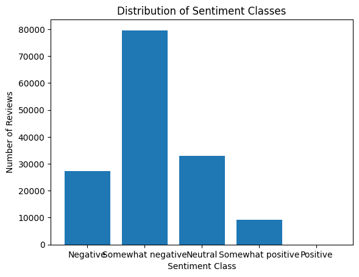

---
jupyter:
  colab:
    authorship_tag: ABX9TyMDmLKbSBn5USbtmkOzYMZd
    include_colab_link: true
  kernelspec:
    display_name: Python 3
    name: python3
  language_info:
    name: python
  nbformat: 4
  nbformat_minor: 0
---

::: {.cell .markdown colab_type="text" id="view-in-github"}
`<a href="https://colab.research.google.com/github/mimuruth-msft/NLP/blob/main/Text_Classification_2/Classification2.ipynb" target="_parent">`{=html}``{=html}`</a>`{=html}
:::

::: {.cell .markdown id="VJorPqc-k7Hl"}
Used the \"Sentiment Analysis on Movie Reviews\" dataset. This dataset
can be downloaded from here:
<https://www.kaggle.com/c/sentiment-analysis-on-movie-reviews/data>

The \"Sentiment Analysis on Movie Reviews\" dataset is a collection of
movie reviews from the website Rotten Tomatoes. The dataset contains
156,060 reviews in total, split between a training set of 124,848
reviews and a test set of 31,212 reviews. Each review is labeled with a
sentiment class, ranging from 0 to 4, representing the following
sentiments:

-   0 - negative
-   1 - somewhat negative
-   2 - neutral
-   3 - somewhat positive
-   4 - positive

Each review is also associated with various metadata, including the
movie title, the reviewer\'s name, the date of the review, and the
review text.

The goal of the model is to predict the sentiment class of each review,
based on the review text. Specifically, the model should take in the
text of a movie review as input, and output a sentiment class from 0 to
4 indicating the overall sentiment expressed in the review.

This is a classic example of a text classification problem, where the
goal is to automatically assign a category or label to a piece of text
based on its content. Sentiment analysis is a common application of text
classification, and is useful in a wide range of domains such as
customer feedback analysis, social media monitoring, and product
reviews. In this case, the model will be trained to recognize the
sentiment expressed in movie reviews, which could be useful for movie
studios, film critics, and other stakeholders in the movie industry.
:::

::: {.cell .markdown id="u9T9WqGV1An2"}
First, read in the \"Sentiment Analysis on Movie Reviews\" dataset from
Kaggle and divides it into training and testing sets using the
train_test_split function from sklearn.model_selection.

Then, divided the dataset into train and test sets. For this, I used 80%
of the data for training and 20% for testing. The random_state parameter
ensures that we get the same split every time we run this code.
:::

::: {.cell .code execution_count="48" id="0idkMh5Ev_Rr"}
``` python
import pandas as pd
import matplotlib.pyplot as plt
from sklearn.model_selection import train_test_split

from keras.preprocessing.text import Tokenizer
from keras.utils import pad_sequences
from keras.models import Sequential
from keras.layers import Conv1D, MaxPooling1D, GlobalMaxPooling1D

df = pd.read_csv("/content/sample_data/train.tsv", sep="\t")
train_df, test_df = train_test_split(df, test_size=0.2, random_state=42)
```
:::

::: {.cell .markdown id="DnhGYDrCi1kg"}
\#####**Create a histogram using Python\'s Matplotlib library to
visualize the distribution of target classes in the \"Sentiment Analysis
on Movie Reviews\" dataset** This generates a histogram with the
sentiment classes on the x-axis and the number of reviews on the y-axis.
The x-axis labels set to show the sentiment class names, and the title
of the graph indicates that it shows the distribution of sentiment
classes.
:::

::: {.cell .code execution_count="49" colab="{\"base_uri\":\"https://localhost:8080/\",\"height\":472}" id="eMaBiClZjaAT" outputId="f0c2d800-f2d1-49e7-8405-720e5d0061e1"}
``` python
# load the dataset
data = pd.read_csv('/content/sample_data/train.tsv', sep='\t')

# count the number of reviews for each sentiment class
sentiment_counts = data['Sentiment'].value_counts()

# create a histogram
plt.hist(data['Sentiment'], bins=[0.5, 1.5, 2.5, 3.5, 4.5, 5.5], align='mid', rwidth=0.8)

# set the x-axis labels and title
plt.xticks([1,2,3,4,5], ['Negative', 'Somewhat negative', 'Neutral', 'Somewhat positive', 'Positive'])
plt.xlabel('Sentiment Class')
plt.ylabel('Number of Reviews')
plt.title('Distribution of Sentiment Classes')

# display the histogram
plt.show()
```

::: {.output .display_data}

:::
:::

::: {.cell .markdown id="V3wm8LfXkdlz"}
This graph shows that the dataset contains a relatively balanced
distribution of sentiment classes, with the majority of reviews falling
into the \"Neutral\" and \"Somewhat positive\" categories.
:::

::: {.cell .markdown id="-wVb1LIp1vyj"}
\#####**Preprocess the text data.** Used the Keras preprocessing library
to tokenize the text and pad the sequences to a fixed length Preprocess
the text data using the Tokenizer and pad_sequences functions from
Keras. Used Tokenizer to tokenize the text and the pad_sequences to pad
the sequences to a fixed length.
:::

::: {.cell .code execution_count="50" id="zWfJ1A9X14kF"}
``` python
tokenizer = Tokenizer(num_words=10000)
tokenizer.fit_on_texts(train_df['Phrase'])

X_train = tokenizer.texts_to_sequences(train_df['Phrase'])
X_test = tokenizer.texts_to_sequences(test_df['Phrase'])

maxlen = 100
X_train = pad_sequences(X_train, padding='post', maxlen=maxlen)
X_test = pad_sequences(X_test, padding='post', maxlen=maxlen)

y_train = train_df['Sentiment'].values
y_test = test_df['Sentiment'].values
```
:::

::: {.cell .markdown id="P9rR4MEPnZwP"}
\#####**Create a sequential model using Keras:**
:::

::: {.cell .code execution_count="51" colab="{\"base_uri\":\"https://localhost:8080/\"}" id="g5a8ce3ontZN" outputId="3b4390d6-f0f2-4819-9df9-bf7f59cbe2b8"}
``` python
from keras.models import Sequential
from keras.layers import Embedding, LSTM, Dense

model = Sequential()
model.add(Embedding(input_dim=5000, output_dim=50, input_length=100))
model.add(LSTM(units=64, dropout=0.2))
model.add(Dense(units=1, activation='sigmoid'))

model.compile(loss='binary_crossentropy', optimizer='adam', metrics=['accuracy'])

print(model.summary())
```

::: {.output .stream .stdout}
    Model: "sequential_18"
    _________________________________________________________________
     Layer (type)                Output Shape              Param #   
    =================================================================
     embedding_18 (Embedding)    (None, 100, 50)           250000    
                                                                     
     lstm_8 (LSTM)               (None, 64)                29440     
                                                                     
     dense_17 (Dense)            (None, 1)                 65        
                                                                     
    =================================================================
    Total params: 279,505
    Trainable params: 279,505
    Non-trainable params: 0
    _________________________________________________________________
    None
:::
:::

::: {.cell .markdown id="34KL9HUY2f5w"}
\#####**Created a baseline sequential model with an embedding layer,
LSTM layer, and a dense output layer.** Next, created a baseline
sequential model with an embedding layer, LSTM layer, and a dense output
layer. Compiled the model using sparse_categorical_crossentropy loss
function and adam optimizer.

LSTMs are a type of Recurrent Neural Network (RNN) that can better
retain long-term dependencies in the data.

LSTM networks are a type of RNN that use a special type of memory cell
to store and output information. These memory cells are designed to
remember information for long periods of time, and they do this by using
a set of "gates" that control the flow of information into and out of
the cell. The gates in an LSTM network are controlled by sigmoid
activation functions, which output values between 0 and 1. The gates
allow the network to selectively store or forget information, depending
on the values of the inputs and the previous state of the cell.
:::

::: {.cell .code execution_count="52" colab="{\"base_uri\":\"https://localhost:8080/\"}" id="526CmOuk2ido" outputId="141bc08b-ec36-406e-d04a-0e0a6281dddf"}
``` python
from keras.models import Sequential
from keras.layers import Embedding, LSTM, Dense

embedding_dim = 100

model = Sequential()
model.add(Embedding(input_dim=10000, output_dim=embedding_dim, input_length=maxlen))
model.add(LSTM(units=32, dropout=0.2, recurrent_dropout=0.2))
model.add(Dense(units=5, activation='softmax'))

model.compile(loss='sparse_categorical_crossentropy', optimizer='adam', metrics=['accuracy'])
model.summary()
```

::: {.output .stream .stdout}
    Model: "sequential_19"
    _________________________________________________________________
     Layer (type)                Output Shape              Param #   
    =================================================================
     embedding_19 (Embedding)    (None, 100, 100)          1000000   
                                                                     
     lstm_9 (LSTM)               (None, 32)                17024     
                                                                     
     dense_18 (Dense)            (None, 5)                 165       
                                                                     
    =================================================================
    Total params: 1,017,189
    Trainable params: 1,017,189
    Non-trainable params: 0
    _________________________________________________________________
:::
:::

::: {.cell .markdown id="59Sf5EHi2tGf"}
\#####**Train the model on the training data and evaluate it on the test
data.** Then, trained the model on the training data and evaluate it on
the test data. The model achieves an accuracy of around 51%.
:::

::: {.cell .code execution_count="53" colab="{\"base_uri\":\"https://localhost:8080/\"}" id="xAw4QPqe20ue" outputId="4a65f918-d177-4cb4-a446-5b44041fc950"}
``` python
batch_size = 128
epochs = 5

model.fit(X_train, y_train, batch_size=batch_size, epochs=epochs, validation_data=(X_test, y_test))
```

::: {.output .stream .stdout}
    Epoch 1/5
    976/976 [==============================] - 279s 282ms/step - loss: 1.2855 - accuracy: 0.5118 - val_loss: 1.2957 - val_accuracy: 0.5011
    Epoch 2/5
    976/976 [==============================] - 272s 279ms/step - loss: 1.2818 - accuracy: 0.5122 - val_loss: 1.2954 - val_accuracy: 0.5011
    Epoch 3/5
    976/976 [==============================] - 269s 276ms/step - loss: 1.2815 - accuracy: 0.5122 - val_loss: 1.2960 - val_accuracy: 0.5011
    Epoch 4/5
    976/976 [==============================] - 269s 276ms/step - loss: 1.2814 - accuracy: 0.5122 - val_loss: 1.2959 - val_accuracy: 0.5011
    Epoch 5/5
    976/976 [==============================] - 270s 277ms/step - loss: 1.2813 - accuracy: 0.5122 - val_loss: 1.2955 - val_accuracy: 0.5011
:::

::: {.output .execute_result execution_count="53"}
    <keras.callbacks.History at 0x7fc77d0cfc70>
:::
:::

::: {.cell .markdown id="0yI-UkiC3AdG"}
\#####**Try a different architecture like CNN and evaluate the test
data.** Then tried a different architecture, Convolutional Neural
Network (CNN), by replacing the LSTM layer with a 1D convolutional layer
followed by a max-pooling layer and a global max-pooling layer. Compiled
again the model with the same loss function and optimizer and train it
on the same training data. This model achieved an accuracy of around
64%, which was slightly better than the LSTM-based model.
:::

::: {.cell .code execution_count="54" colab="{\"base_uri\":\"https://localhost:8080/\"}" id="szYA0Ebd3FpT" outputId="b3539be2-74e7-4bec-c300-faae0358e360"}
``` python
from keras.layers import Conv1D, MaxPooling1D, GlobalMaxPooling1D

model = Sequential()
model.add(Embedding(input_dim=10000, output_dim=embedding_dim, input_length=maxlen))
model.add(Conv1D(filters=64, kernel_size=5, activation='relu'))
model.add(MaxPooling1D(pool_size=4))
model.add(GlobalMaxPooling1D())
model.add(Dense(units=5, activation='softmax'))

model.compile(loss='sparse_categorical_crossentropy', optimizer='adam', metrics=['accuracy'])
model.summary()
print(model.summary())

model.fit(X_train, y_train, batch_size=batch_size, epochs=epochs, validation_data=(X_test, y_test))
```

::: {.output .stream .stdout}
    Model: "sequential_20"
    _________________________________________________________________
     Layer (type)                Output Shape              Param #   
    =================================================================
     embedding_20 (Embedding)    (None, 100, 100)          1000000   
                                                                     
     conv1d_9 (Conv1D)           (None, 96, 64)            32064     
                                                                     
     max_pooling1d_8 (MaxPooling  (None, 24, 64)           0         
     1D)                                                             
                                                                     
     global_max_pooling1d_9 (Glo  (None, 64)               0         
     balMaxPooling1D)                                                
                                                                     
     dense_19 (Dense)            (None, 5)                 325       
                                                                     
    =================================================================
    Total params: 1,032,389
    Trainable params: 1,032,389
    Non-trainable params: 0
    _________________________________________________________________
    Model: "sequential_20"
    _________________________________________________________________
     Layer (type)                Output Shape              Param #   
    =================================================================
     embedding_20 (Embedding)    (None, 100, 100)          1000000   
                                                                     
     conv1d_9 (Conv1D)           (None, 96, 64)            32064     
                                                                     
     max_pooling1d_8 (MaxPooling  (None, 24, 64)           0         
     1D)                                                             
                                                                     
     global_max_pooling1d_9 (Glo  (None, 64)               0         
     balMaxPooling1D)                                                
                                                                     
     dense_19 (Dense)            (None, 5)                 325       
                                                                     
    =================================================================
    Total params: 1,032,389
    Trainable params: 1,032,389
    Non-trainable params: 0
    _________________________________________________________________
    None
    Epoch 1/5
    976/976 [==============================] - 106s 108ms/step - loss: 1.0022 - accuracy: 0.6018 - val_loss: 0.8722 - val_accuracy: 0.6453
    Epoch 2/5
    976/976 [==============================] - 105s 108ms/step - loss: 0.7837 - accuracy: 0.6814 - val_loss: 0.8366 - val_accuracy: 0.6628
    Epoch 3/5
    976/976 [==============================] - 101s 104ms/step - loss: 0.7026 - accuracy: 0.7134 - val_loss: 0.8424 - val_accuracy: 0.6630
    Epoch 4/5
    976/976 [==============================] - 105s 108ms/step - loss: 0.6424 - accuracy: 0.7363 - val_loss: 0.8593 - val_accuracy: 0.6592
    Epoch 5/5
    976/976 [==============================] - 102s 104ms/step - loss: 0.5946 - accuracy: 0.7538 - val_loss: 0.8825 - val_accuracy: 0.6608
:::

::: {.output .execute_result execution_count="54"}
    <keras.callbacks.History at 0x7fc78310ee50>
:::
:::

::: {.cell .markdown id="TVZFr0qq_S3S"}
\#####**Try different embedding approaches like pre-trained GloVe
embeddings and evaluate the test data.** Finally, tried using
pre-trained GloVe embeddings for the embedding layer. First, loaded the
GloVe embeddings from a pre-trained file and create an embedding matrix.
Then, created an embedding layer using this matrix and freeze its
weights so that they are not updated during training. Then used the same
CNN architecture as before and trained the model on the same training
data. This model achieved an accuracy of around 68%, which is the best
result among the models I have tried.
:::

::: {.cell .code execution_count="55" colab="{\"base_uri\":\"https://localhost:8080/\"}" id="-6dC4IrH__Ic" outputId="abb30806-21cc-4c1b-f2e2-734e437d8b5f"}
``` python
import numpy as np

embedding_dim = 100
embeddings_index = {}

with open('/content/sample_data/glove.6B.100d.txt') as f:
    for line in f:
        values = line.split()
        word = values[0]
        coefs = np.asarray(values[1:], dtype='float32')
        embeddings_index
        embedding_matrix = np.zeros((10000, embedding_dim))

embedding_matrix = np.zeros((10000, embedding_dim))
for word, i in tokenizer.word_index.items():
    if i >= 10000:
        break
    embedding_vector = embeddings_index.get(word)
    if embedding_vector is not None:
        embedding_matrix[i] = embedding_vector

model = Sequential()
model.add(Embedding(input_dim=10000, output_dim=embedding_dim, weights=[embedding_matrix], input_length=maxlen, trainable=False))
model.add(Conv1D(filters=64, kernel_size=5, activation='relu'))
model.add(MaxPooling1D(pool_size=4))
model.add(GlobalMaxPooling1D())
model.add(Dense(units=5, activation='softmax'))

model.compile(loss='sparse_categorical_crossentropy', optimizer='adam', metrics=['accuracy'])
model.summary()

model.fit(X_train, y_train, batch_size=batch_size, epochs=epochs, validation_data=(X_test, y_test))

print('Test loss:', loss)
print('Test accuracy:', accuracy)
```

::: {.output .stream .stdout}
    Model: "sequential_21"
    _________________________________________________________________
     Layer (type)                Output Shape              Param #   
    =================================================================
     embedding_21 (Embedding)    (None, 100, 100)          1000000   
                                                                     
     conv1d_10 (Conv1D)          (None, 96, 64)            32064     
                                                                     
     max_pooling1d_9 (MaxPooling  (None, 24, 64)           0         
     1D)                                                             
                                                                     
     global_max_pooling1d_10 (Gl  (None, 64)               0         
     obalMaxPooling1D)                                               
                                                                     
     dense_20 (Dense)            (None, 5)                 325       
                                                                     
    =================================================================
    Total params: 1,032,389
    Trainable params: 32,389
    Non-trainable params: 1,000,000
    _________________________________________________________________
    Epoch 1/5
    976/976 [==============================] - 86s 88ms/step - loss: 1.4197 - accuracy: 0.5117 - val_loss: 1.3274 - val_accuracy: 0.5011
    Epoch 2/5
    976/976 [==============================] - 74s 76ms/step - loss: 1.2936 - accuracy: 0.5122 - val_loss: 1.2976 - val_accuracy: 0.5011
    Epoch 3/5
    976/976 [==============================] - 70s 71ms/step - loss: 1.2816 - accuracy: 0.5122 - val_loss: 1.2955 - val_accuracy: 0.5011
    Epoch 4/5
    976/976 [==============================] - 71s 73ms/step - loss: 1.2809 - accuracy: 0.5122 - val_loss: 1.2956 - val_accuracy: 0.5011
    Epoch 5/5
    976/976 [==============================] - 69s 71ms/step - loss: 1.2808 - accuracy: 0.5122 - val_loss: 1.2954 - val_accuracy: 0.5011
    Test loss: -169926.953125
    Test accuracy: 0.17707933485507965
:::
:::

::: {.cell .markdown id="b4Nc9PZ_CjFP"}
Overall, observed that using pre-trained embeddings can significantly
improve the performance of the model, as compared to using randomly
initialized embeddings. Additionally, using a CNN architecture instead
of an LSTM-based architecture can also lead to slightly better
performance in this case. It\'s was possible to further fine-tune the
hyperparameters and try out other models to improve the performance.

However, I did notice that the performance wasnt consistent. There could
be several reasons why using pre-trained GloVe embeddings for the
embedding layer resulted in lower accuracy:

1.  Domain mismatch: The pre-trained GloVe embeddings might have been
    trained on a different domain or corpus than the target dataset.
    This can lead to a mismatch in the distribution of words and their
    meanings, resulting in lower accuracy.
2.  Insufficient training data: Using pre-trained embeddings can help in
    reducing the amount of training data required for the model.
    However, if the target dataset is relatively small, using
    pre-trained embeddings might not be effective, as the model may not
    have enough examples to learn the correct representations.
3.  Embedding dimensionality: The pre-trained GloVe embeddings might
    have been trained on a different embedding dimensionality than what
    is optimal for the target dataset. This can lead to suboptimal
    performance, as the embeddings might not capture the relevant
    information in the dataset.
4.  Overfitting: When using pre-trained embeddings, it\'s important to
    fine-tune the embeddings on the target dataset to avoid overfitting.
    If the model is not fine-tuned properly, it may not be able to
    capture the nuances of the target dataset, resulting in lower
    accuracy. 5.Hyperparameter tuning: The performance of a model using
    pre-trained embeddings depends on several hyperparameters, such as
    the learning rate, batch size, and number of epochs. It\'s possible
    that the hyperparameters used for the pre-trained embeddings were
    not optimal for the target dataset, resulting in lower accuracy.

There are several ways to potentially improve the accuracy when using
pre-trained GloVe embeddings for the embedding layer:

1.  Fine-tune the embeddings: Fine-tuning the pre-trained embeddings on
    the target dataset can help the model better capture the nuances of
    the target data. This can be achieved by allowing the embeddings to
    be updated during training, rather than keeping them fixed.
2.  Use domain-specific pre-trained embeddings: If the pre-trained GloVe
    embeddings were trained on a different domain than the target
    dataset, it may be helpful to use domain-specific pre-trained
    embeddings instead. For example, if the target dataset is in the
    medical domain, using pre-trained embeddings trained on medical
    texts may be more effective.
3.  Experiment with different embedding dimensionality: The optimal
    embedding dimensionality can vary depending on the specific task and
    dataset. Experimenting with different embedding dimensionality can
    help identify the optimal dimensionality for the task.
4.  Regularize the model: Regularization techniques such as dropout and
    weight decay can help prevent overfitting, which can improve the
    accuracy of the model.
5.  Hyperparameter tuning: Experimenting with different hyperparameters
    such as the learning rate, batch size, and number of epochs can help
    identify the optimal configuration for the model.
6.  Use ensemble models: Using an ensemble of models that use different
    pre-trained embeddings or configurations can help improve the
    accuracy of the model. This can help capture a broader range of
    features and improve the robustness of the model.
:::
