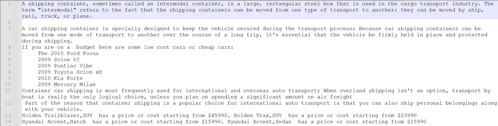
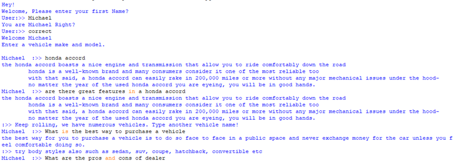

**Objectives:**

- Understand the importance of corpora in NLP tasks
- Understand basic HTML
- Understand how web sites work
- Be able to do web scraping with Beautiful Soup or other APIs
- Create a web crawler

**Instructions:**

1. Build a web crawler function that starts with a URL representing a topic (a sport, your favorite film, a celebrity, a political issue, etc.) and outputs a list of at least 15 relevant URLs. The URLs can be pages within the original domain but should have a few outside. the original domain.
2. Write a function to loop through your URLs and scrape all text off each page. Store each page’s text in its own file.
3. Write a function to clean up the text from each file. You might need to delete newlines and tabs first. Extract sentences with NLTK’s sentence tokenizer. Write the sentences for each file to a new file. That is, if you have 15 files in, you have 15 files out.
4. Write a function to extract at least 25 important terms from the pages using an importance measure such as term frequency, or tf-idf. First, it’s a good idea to lowercase everything, remove stopwords and punctuation. Print the top 25-40 terms.
5. Manually determine the top 10 terms from step 4, based on your domain knowledge.
6. Build a searchable knowledge base of facts that a chatbot (to be developed later) can share related to the 10 terms. The “knowledge base” can be as simple as a Python dict which you can pickle. More points for something more sophisticated like sql.

**Web Crawler**

**Scraping website and extracting data.**

1) **Topic Or Start URLs:** 

 -- <https://www.autoauctionmall.com/learning-center/used-cars/>

-- <http://thefactfile.org/car-facts/>

<https://www.a1autotransport.com/container-car-shipping-faq-and-answers/>

<https://www.consumerreports.org/car-reliability/10-most-reliable-car>

<https://www.caranddriver.com/first-drives/>

These are a car selling website which lists several types of cars together with their model, year, type, and price. 

Note: some sites detect and deter access of their pages using a software code and their data is saved in complex formats making it hard to parse and generate text data.

1) **Crawler** 

A web crawler is an automated program or software that systematically browses the internet, typically for the purpose of indexing or collecting information. It follows links between web pages and collecting information from websites. It starts at a particular web page and follows links to other pages, creating an index or database of the web's content. Web crawlers are commonly used by search engines to build their indexes but can also be used for other purposes such as data mining or monitoring website changes.

This crawler is a Python code, which takes the URL and parses the page looking for links. It reads through the website and takes links which are then used to extract data. To achieve this, I used Beautiful Soup which is a Python library that is commonly used for web scraping purposes for tasks such as data mining, web scraping, and web automation. It provides a set of functions for parsing HTML and XML documents and navigating their content and allows you to extract data from HTML and XML documents by providing a simple interface for traversing the parse tree. It can handle poorly formed HTML and XML documents, which can be common on the web. 

This helped to narrow down to the **div** tag where the models were listed. I only limited their number to 12 URLs as required.

After getting the URLs, I used the **urllib** (sometimes shipped with Python) in conjunction with beautiful soup module to get the entire pages downloaded. (urllib is a Python module that provides a collection of functions for working with URLs. It is part of the standard library in Python, so it doesn't require any additional installation).

These were saved in a folder called **pages.** Alongside with the Python code, I used **html2text** module to extract text content from HTML (removes html tags). It’s a Python library that converts HTML documents to plain text format. It’s designed to extract human-readable content from HTML documents while preserving the basic structure and formatting of the original document.

As suggested, I used the **NLTK** module, which comes in handy in extracting and structuring data, to get sentences and save them in a folder called “cleaned”.

In addition, I created some other functions (methods) to further clean the extracted text. These methods only remove some common phrases and empty lines. Finally, I removed all unnecessary data manually leaving behind the useful parts only.

In case you don’t have these modules, you can install them using this pip install commands.

`	`pip install html2text

`	`pip install nltk

`	`pip install beautifulsoup4

1) **Making a searchable Knowledge base**

To make the data searchable, I included all the contents of the files into one file named **knowledgebase.txt** and manually reorganized the data separating each field data with a **|** (pipe)**.**  The chatbot (to be developed later) will first read all this data to a dictionary, so as to facilitate search.

Sample screen shots of the knowledge base

Sample dialog for the chatbot based on your knowledge base

